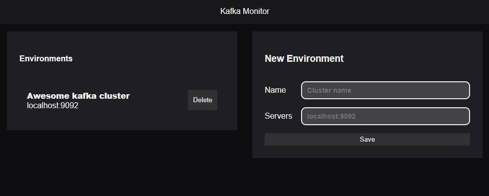

<div id="top"></div>

[![Contributors][contributors-shield]][contributors-url]
[![Forks][forks-shield]][forks-url]
[![Stargazers][stars-shield]][stars-url]
[![Issues][issues-shield]][issues-url]
[![MIT License][license-shield]][license-url]
[![LinkedIn][linkedin-shield]][linkedin-url]

<!-- PROJECT LOGO -->
<br />

<div align="center">
  <h3 align="center">Kafka Monitor</h3>
  <br />
  <p align="center">
    <a href="https://github.com/danielpp95/kafka-monitor/releases">Download the app</a>
    ·
    <a href="https://github.com/danielpp95/kafka-monitor/issues">Report Bug</a>
    ·
    <a href="https://github.com/danielpp95/kafka-monitor/issues">Request Feature</a>
  </p>
</div>

<!-- TABLE OF CONTENTS -->
<br/>

<details>
  <summary>Table of Contents</summary>
  <ol>
    <li>
      <a href="#about-the-project">About The Project</a>
      <ul><li><a href="#built-with">Built With</a></li></ul>
    </li>
    <li><a href="#getting-started">Getting Started</a></li>
    <li><a href="#contributing">Contributing</a></li>
    <li><a href="#license">License</a></li>
    <li><a href="#contact">Contact</a></li>
  </ol>
</details>

<br/>

<!-- ABOUT THE PROJECT -->
## About The Project


Kafka Monitor is a tool that allows you to monitor and manage your Kafka cluster.

<p align="right">(<a href="#top">back to top</a>)</p>


### Built With
- JavaScript
- [kafkaJs](https://kafka.js.org/)
- [Nextron](https://github.com/saltyshiomix/nextron)

<p align="right">(<a href="#top">back to top</a>)</p>


<!-- GETTING STARTED -->
## Getting Started

Install the dependencies.
  ```sh
  $ npm install
  // or
  $ yarn
  ```

Test the app in dev mode.
  ```sh
  $ npm run dev
  // or
  $ yarn dev
  ```

Make a new build
```ssh
Commands by Operative System
- build:win32
- build:win64
- build:mac
- build:linux

  $ npm run <command>
  // or
  $ yarn <command>
```
<p align="right">(<a href="#top">back to top</a>)</p>


<!-- CONTRIBUTING -->
## Contributing

Contributions are what make the Open Source community such an amazing place to learn, inspire, and create. Any contributions you make are **greatly appreciated**.

If you have a suggestion that would make this better, please fork the repo and create a Pull Request. You can also simply [open an issue][issues-url] with the tag *enhancement*.

Don't forget to **give the project a star ⭐!** Thanks again!

1. Fork the project

2. Clone the repository

```bash
git clone https://github.com/@username/kafka-monitor
```

3. Create your Feature Branch

```bash
git checkout -b feature/AmazingFeature
```

4. Push to the Branch

```bash
git push origin feature/AmazingFeature
```

5. Open a Pull Request

<p align="right">(<a href="#top">back to top</a>)</p>


<!-- LICENSE -->
## License

Distributed under the MIT License. See `LICENSE.md` for more information.

<p align="right">(<a href="#top">back to top</a>)</p>


<!-- CONTACT -->
## Contact

Daniel Pereira - [@aquiOtroDaniel](https://twitter.com/aquiOtroDaniel) - [danielpp95](https://github.com/danielpp95)

Project Link: [https://github.com/danielpp95/kafka-monitor](https://github.com/danielpp95/kafka-monitor)

<p align="right">(<a href="#top">back to top</a>)</p>


<!-- MARKDOWN LINKS & IMAGES -->
<!-- https://www.markdownguide.org/basic-syntax/#reference-style-links -->
[contributors-shield]: https://img.shields.io/github/contributors/danielpp95/kafka-monitor.svg?style=for-the-badge
[contributors-url]: https://github.com/danielpp95/kafka-monitor/graphs/contributors
[forks-shield]: https://img.shields.io/github/forks/danielpp95/kafka-monitor.svg?style=for-the-badge
[forks-url]: https://github.com/danielpp95/kafka-monitor/network/members
[stars-shield]: https://img.shields.io/github/stars/danielpp95/kafka-monitor.svg?style=for-the-badge
[stars-url]: https://github.com/danielpp95/kafka-monitor/stargazers
[issues-shield]: https://img.shields.io/github/issues/danielpp95/kafka-monitor.svg?style=for-the-badge
[issues-url]: https://github.com/danielpp95/kafka-monitor/issues
[license-shield]: https://img.shields.io/github/license/danielpp95/kafka-monitor.svg?style=for-the-badge
[license-url]: https://github.com/danielpp95/kafka-monitor/blob/master/LICENSE.md
[linkedin-shield]: https://img.shields.io/badge/-LinkedIn-black.svg?style=for-the-badge&logo=linkedin&colorB=555
[linkedin-url]: https://linkedin.com/in/danielpp95
[product-screenshot]: https://firebasestorage.googleapis.com/v0/b/kafka-monitor-a2d13.appspot.com/o/prototype.png?alt=media